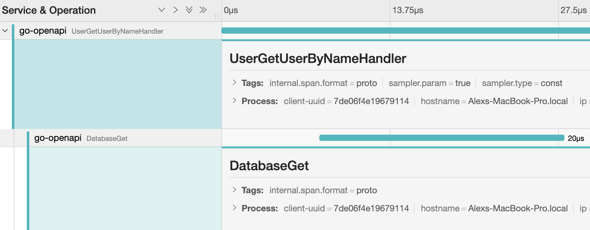

# go-openapi ✨

This project demonstrates how to implement logs, tracing and metrics.

- Metrics are scrappable from /metrics.
- Traces are configurable to be sent via jaeger environmental vars ( e.g. JAEGER_SERVICE_NAME )
- Logs are structured and ready for a stdout appender sidecar.

It can be consumed and automatically deployed to Kubernetes ( with generation of charts ).

#### Key technologies ⚙️

- OpenAPI
- Kubernetes
- Docker
- Gitlab
- Prometheus
- Jaeger
- Logging
- go-memdb ( in memory db )
- AutoDevops

### Regenerate the code 💅🏼

This project uses OPENAPI2.0 this means you can generate all the stub code from the spec.

```
brew tap go-swagger/go-swagger
brew install go-swagger

swagger generate server -f static/swagger.yaml -A go-openapi --exclude-main
```

Running...

```
go run cmd/go-openapi/main.go
```

View the UI...

```
http://127.0.0.1:8080/v2/docs
```

View metrics

```
http://127.0.0.1:8080/metrics
```

## Do something 🤷🏼‍♀️
```bash
# Create a user
 curl -X POST "http://localhost:8080/v2/user" -H  "accept: application/xml" -H  "Content-Type: application/json" -d "{  \"email\": \"string\",  \"firstName\": \"string\",  \"id\": 0,  \"lastName\": \"string\",  \"password\": \"string\",  \"phone\": \"string\",  \"userStatus\": 0,  \"username\": \"alex\"}"
# Get that user
curl -X GET "http://localhost:8080/v2/user/alex" -H  "accept: application/xml" -v
```

#### Log output

```
{"app":"go-openapi","headers":{"Accept":["application/xml"],"Content-Length":["160"],"Content-Type":["application/json"],"Uber-Trace-Id":["0f7fcb90ad717acb:0f7fcb90ad717acb:0000000000000000:1"],"User-Agent":["curl/7.64.1"]},"host":"localhost:8080","level":"info","method":"POST","msg":"CreateUserHandlerFunc","requestPath":"/v2/user","time":"2021-03-13T21:22:12Z","username":"alex"}
{"level":"info","msg":"Reporting span 0ebb18973152a625:6761e45df47fc84d:0ebb18973152a625:1","time":"2021-03-13T21:22:12Z"}
{"level":"info","msg":"Reporting span 0ebb18973152a625:0ebb18973152a625:0000000000000000:1","time":"2021-03-13T21:22:12Z"}
{"level":"info","msg":"Reporting span 0f7fcb90ad717acb:0f7fcb90ad717acb:0000000000000000:1","time":"2021-03-13T21:22:12Z"}
{"app":"go-openapi","headers":{"Accept":["application/json"],"Uber-Trace-Id":["5e4a718c6705716f:5e4a718c6705716f:0000000000000000:1"],"User-Agent":["curl/7.64.1"]},"host":"localhost:8080","level":"info","method":"GET","msg":"UserGetUserByNameHandler","requestPath":"/v2/user/alex","time":"2021-03-13T21:22:18Z","username":"alex"}
{"level":"info","msg":"Reporting span 04c676665241d9dd:5d1b7205328840e9:04c676665241d9dd:1","time":"2021-03-13T21:22:18Z"}
{"level":"info","msg":"Reporting span 04c676665241d9dd:04c676665241d9dd:0000000000000000:1","time":"2021-03-13T21:22:18Z"}
{"level":"info","msg":"Reporting span 5e4a718c6705716f:5e4a718c6705716f:0000000000000000:1","time":"2021-03-13T21:22:18Z"}
```


#### Run Jaeger 

Set `JAEGER_AGENT_HOST` and `JAEGER_AGENT_PORT` otherwise you can run locally with docker...

```
docker run -d --name jaeger \
  -e COLLECTOR_ZIPKIN_HTTP_PORT=9411 \
  -p 5775:5775/udp \
  -p 6831:6831/udp \
  -p 6832:6832/udp \
  -p 5778:5778 \
  -p 16686:16686 \
  -p 14268:14268 \
  -p 14250:14250 \
  -p 9411:9411 \
  jaegertracing/all-in-one:1.22
```


